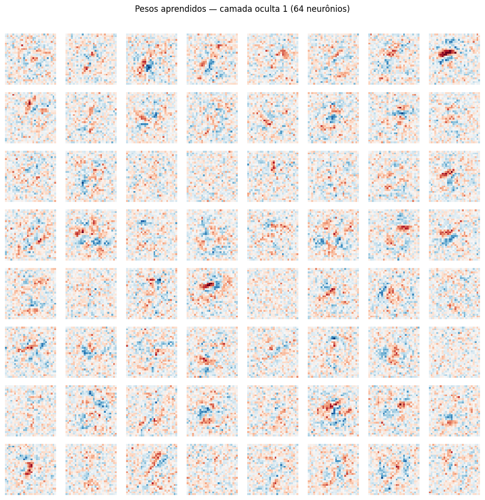

# MLP do Zero — Classificação de Dígitos MNIST

Implementação manual de um Multi-Layer Perceptron usando apenas NumPy, sem frameworks de deep learning.

---

## Como rodar

```bash
# 1. Instalar dependências
pip install -r requirements.txt

# 2. Rodar todos os experimentos e gerar os plots
python run_experiments.py

# 3. Ou abrir o notebook interativo
jupyter notebook notebooks/experimentos.ipynb
```

O script `run_experiments.py` baixa o MNIST automaticamente (via `urllib`, sem keras nem torch), treina quatro configurações e salva todos os plots em `results/`.

---

## Estrutura do repositório

```
.
├── README.md
├── run_experiments.py     ← executa tudo de uma vez
├── mlp/
│   ├── __init__.py
│   ├── network.py         ← classe MLP: forward, backward, train, gradient_check
│   ├── activations.py     ← ReLU, Sigmoid, Softmax e suas derivadas
│   ├── losses.py          ← cross-entropy e gradiente combinado com softmax
│   ├── optimizers.py      ← SGD (com momentum) e Adam
│   └── data.py            ← loader próprio do MNIST via urllib
├── notebooks/
│   └── experimentos.ipynb ← experimentos interativos e análises
├── results/
│   ├── curves_comparison.png
│   ├── confusion_matrix.png
│   ├── weights_visualization.png
│   └── tsne_embeddings.png
└── requirements.txt
```

---

## Arquitetura escolhida

| Componente | Escolha | Motivo |
|---|---|---|
| Camadas ocultas | 2–3 camadas | Suficiente para MNIST; mais camadas não trazem ganho relevante nesse dataset |
| Neurônios | 256–512 por camada | Balanceia capacidade e tempo de treino |
| Ativação oculta | ReLU | Não satura (evita gradiente nulo), converge rápido, padrão atual |
| Ativação de saída | Softmax | Produz distribuição de probabilidade sobre 10 classes |
| Loss | Cross-entropy | Par natural com softmax; gradiente combinado é simples: `(ŷ - y) / n` |
| Inicialização | He (`sqrt(2/fan_in)`) | Projetada para ReLU; mantém variância estável entre camadas |
| Otimizadores | SGD, SGD+momentum, Adam | Comparação direta entre as três estratégias |

---

## Resultados

### Tabela comparativa de experimentos

| Exp | Camadas ocultas | Otimizador | Test Acc |
|-----|-----------------|------------|----------|
| A | 256-128 | SGD lr=0.1 | 98.00% |
| B | 512-256-128 | SGD lr=0.1 | 98.18% |
| C | 256-128 | Adam lr=0.001 | 97.98% |
| D | 256-128 | SGD momentum=0.9 lr=0.05 | **98.23%** |

Todos os experimentos superam a meta de 92%. Melhor modelo: Exp D (98.23%).

Surpreendentemente, Adam não ganhou do SGD com momentum nesse cenário — ambos convergiram para resultados muito próximos, mas o SGD+momentum foi mais estável nas épocas finais (a val_loss do Adam começou a oscilar após o epoch 10, sinal de overfitting leve).

### Curvas de loss e acurácia


### Matriz de confusão — melhor modelo (Exp D)


Os erros mais comuns são nos pares 4↔9 e 3↔5 — dígitos visualmente semelhantes mesmo para humanos. O modelo erra menos de 2% das amostras.

### Pesos aprendidos pela primeira camada



É possível ver padrões orientados de bordas e curvas, similares aos filtros de uma CNN — a rede aprendeu detectores de features primitivas sem nenhuma indução de estrutura espacial.

### t-SNE dos embeddings da penúltima camada


A última camada oculta aprendeu representações bem separadas no espaço: cada um dos 10 clusters corresponde a um dígito, com pequena sobreposição nos casos ambíguos (7↔1, 4↔9).

---

## Decisões e dificuldades

### Qual foi a decisão técnica mais difícil?

A decisão mais difícil foi a **inicialização dos pesos**. Na primeira tentativa inicializei tudo com zeros. O resultado foi que todos os neurônios de uma mesma camada produziam exatamente o mesmo gradiente — o problema clássico de simetria. A rede se comportava como se tivesse um único neurônio por camada e a loss não saía de 2.3 (que é `log(10)`, o valor esperado para chute aleatório em 10 classes).

Migrei para inicialização aleatória com escala pequena (`* 0.01`) e funcionou, mas a convergência era lenta. A versão final usa **He initialization** (`sqrt(2/fan_in)`), projetada para manter a variância dos gradientes estável em redes com ReLU. A diferença foi clara: com He o modelo chegava a 90% já no epoch 5.

### O que não funcionou?

**Gradiente da cross-entropy sem divisão por n:** Na primeira versão do `backward` calculei `dZ_out = y_pred - y_true` sem dividir pelo tamanho do batch. O gradiente ficava `batch_size` vezes maior do que deveria, o que equivalia a usar um learning rate efetivo gigante. O gradient check numérico identificou isso imediatamente — a diferença relativa era ~0.5, bem acima do threshold de `1e-4`.

**Learning rate alto no SGD:** Tentei SGD com `lr=0.5`. A loss oscilava entre epochs e em algumas rodadas ia para NaN. O clipping no softmax (`eps = 1e-12`) evitava o `log(0)`, mas o gradiente explodido impedia a convergência. Reduzir para `lr=0.1` resolveu.

**Dependência de keras para carregar o MNIST:** O ambiente não tinha keras, tensorflow nem torch instalados. Em vez de instalar um framework pesado só para baixar dados, escrevi um loader próprio em `mlp/data.py` que baixa os arquivos `.gz` diretamente do repositório oficial via `urllib` e os parseia com `struct` e `numpy`. Zero dependências extras.

**Encoding no Windows:** O terminal usa `cp1252` por padrão, que não suporta o caractere `→` (U+2192). O script travou com `UnicodeEncodeError` ao imprimir a tabela comparativa. Troquei todos os `→` por `-` nas strings de output.

**Parâmetro `n_iter` depreciado no sklearn:** A versão instalada do `scikit-learn` (1.7.2) não aceita mais `n_iter` no `TSNE` — o parâmetro virou `max_iter`. O t-SNE foi pulado na primeira execução com uma exceção silenciosa. Corrigi no script e no notebook.

### Se fosse refazer do zero, o que faria diferente?

Implementaria o **gradient check antes de qualquer outra coisa**, mesmo antes de conectar os dados reais. Com ele na mão, o erro no divisor `n` teria sido pego em segundos. Também testaria em um problema menor primeiro (XOR ou 2 classes do MNIST) para validar cada componente isoladamente antes de escalar para as 10 classes completas.

Para o ambiente, checaria as versões de todas as dependências opcionais (sklearn, matplotlib backend) antes de começar a treinar, não depois de um erro em produção.
