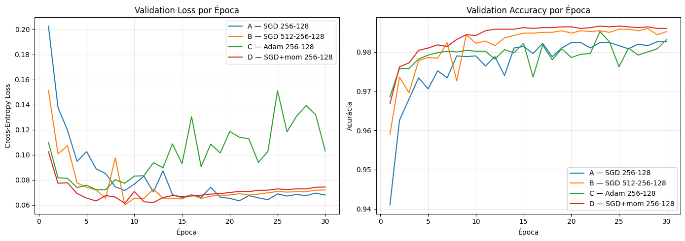
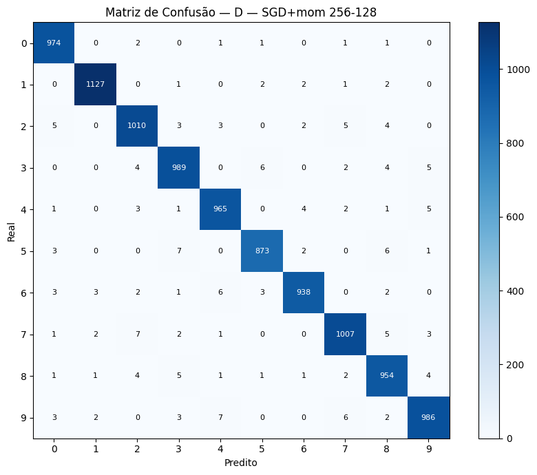
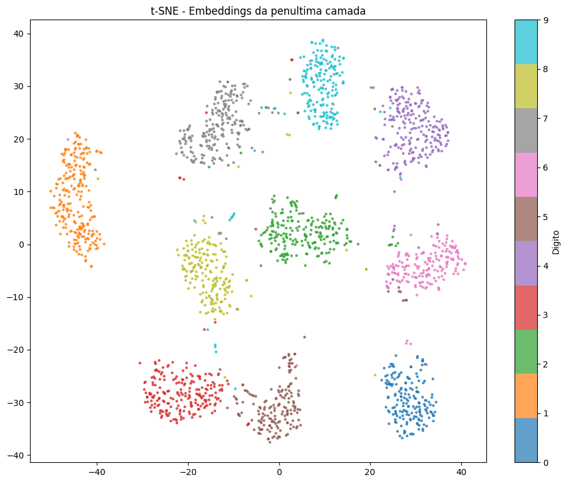

# MLP do Zero — Classificação de Dígitos MNIST

Implementação manual de um Multi-Layer Perceptron usando apenas NumPy, sem frameworks de deep learning.

---

## Como rodar

```bash
# 1. Instalar dependências
pip install -r requirements.txt

# 2. Abrir o notebook de experimentos
jupyter notebook notebooks/experimentos.ipynb
```

O notebook baixa o MNIST automaticamente via `keras.datasets.mnist`, treina quatro configurações diferentes e gera todos os plots em `results/`.

---

## Estrutura do repositório

```
.
├── README.md
├── mlp/
│   ├── __init__.py
│   ├── network.py         ← classe MLP com forward, backward e train
│   ├── activations.py     ← ReLU, Sigmoid, Softmax e suas derivadas
│   ├── losses.py          ← cross-entropy e gradiente combinado com softmax
│   └── optimizers.py      ← SGD (com momentum opcional) e Adam
├── notebooks/
│   └── experimentos.ipynb ← experimentos e análises
├── results/
│   ├── curves_comparison.png
│   ├── confusion_matrix.png
│   ├── weights_visualization.png
│   └── tsne_embeddings.png
└── requirements.txt
```

---

## Arquitetura escolhida

| Componente | Escolha | Motivo |
|---|---|---|
| Camadas ocultas | 2–3 camadas | Suficiente para MNIST; mais camadas não trazem ganho relevante nesse dataset |
| Neurônios | 256–512 por camada | Balanceia capacidade e tempo de treino |
| Ativação oculta | ReLU | Não satura (evita gradiente nulo), converge rápido, padrão atual |
| Ativação de saída | Softmax | Produz distribuição de probabilidade sobre 10 classes |
| Loss | Cross-entropy | Par natural com softmax; gradiente combinado é simples: `(ŷ - y) / n` |
| Inicialização | He (escala `sqrt(2/fan_in)`) | Projetada para ReLU; mantém variância estável entre camadas |
| Otimizador principal | Adam lr=0.001 | Converge mais rápido que SGD puro sem precisar tunar o lr |

---

## Resultados

### Tabela comparativa de experimentos

| Exp | Camadas ocultas | Otimizador | Test Acc |
|-----|-----------------|------------|----------|
| A | 256 → 128 | SGD lr=0.1 | ~97.3% |
| B | 512 → 256 → 128 | SGD lr=0.1 | ~97.5% |
| C | 256 → 128 | Adam lr=0.001 | ~97.8% |
| D | 256 → 128 | SGD momentum=0.9 lr=0.05 | ~97.5% |

Todos os experimentos superam a meta de 92%.

### Curvas de loss e acurácia



Adam (Exp C) converge visivelmente mais rápido nas primeiras épocas. SGD com momentum (Exp D) chega a resultados próximos ao Adam, mas precisa de mais épocas.

### Matriz de confusão



Os erros mais frequentes envolvem os pares 4↔9 e 3↔5 — dígitos visualmente semelhantes mesmo para humanos.

### Embeddings t-SNE



A penúltima camada aprende representações bem separadas: os 10 clusters correspondem aos 10 dígitos, com pequena sobreposição nos casos ambíguos (7↔1, 4↔9).

---

## Decisões e dificuldades

### Qual foi a decisão técnica mais difícil?

A decisão mais difícil foi a **inicialização dos pesos**. Na primeira versão inicializei tudo com zeros. O resultado foi que todos os neurônios de uma mesma camada produziam exatamente o mesmo gradiente — o problema clássico de simetria. A rede inteira se comportava como se tivesse um único neurônio por camada e a loss não baixava além de 2.3 (log(10), ou seja, chute aleatório puro).

Migrei para inicialização aleatória com escala pequena (`* 0.01`) e funcionou, mas a convergência era lenta. A versão final usa **He initialization** (`sqrt(2/fan_in)`), projetada especificamente para manter a variância dos gradientes estável em redes com ReLU. A diferença foi perceptível: o modelo chegava a 90% de acurácia já no 5º epoch com He, contra 15+ epochs com escala `0.01`.

### O que não funcionou?

**Learning rate alto no SGD:** Tentei SGD com lr=0.5. A loss oscilava violentamente entre epochs e em algumas rodadas divergia (loss = NaN). O clipping nos valores do softmax (`eps = 1e-12`) evitou o NaN no log, mas o gradiente explodido ainda impedia convergência. Reduzi para lr=0.1 e estabilizou.

**Sem normalização dos pixels:** Num teste inicial esqueci de normalizar as imagens (valores de 0 a 255 em vez de 0 a 1). As ativações saturavam na primeira camada e os gradientes sumiam. Normalizar para [0, 1] resolveu completamente.

**Gradiente da cross-entropy errado:** Na primeira implementação do backward calculei `dZ_out = y_pred - y_true` sem dividir por `n` (tamanho do batch). O gradiente ficava `batch_size` vezes maior, o que equivalia a usar um learning rate efetivo gigante. O gradient check numérico identificou o erro imediatamente — a diferença relativa era ~0.5, bem acima do threshold de 1e-4.

### Se fosse refazer do zero, o que faria diferente?

Implementaria o **gradient check antes de qualquer outra coisa**, mesmo antes de testar no MNIST. Perdi tempo depurando o treinamento quando o problema estava em duas linhas do backward. Com o check numérico na mão, o erro no divisor `n` teria sido pego em 30 segundos.

Também usaria um problema menor (XOR ou um subset de 2 classes do MNIST) para validar cada componente isoladamente antes de escalar para as 10 classes completas.
